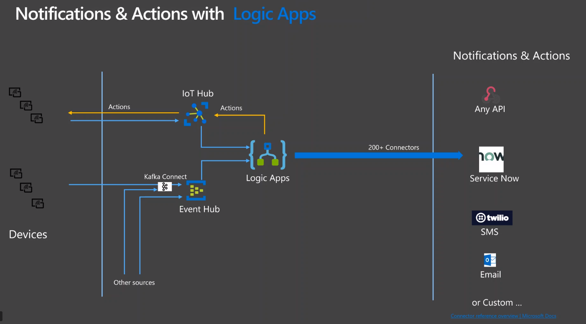

# Streaming Logic App Demo


This project demonstrates how to query streaming data using several Azure technologies:

- Azure Logic Apps
- Azure Eventhubs
- Kafka Connect
- Service Now Integration

Workflow:

- Generator App sents message to Eventhubs
- Logic App will push messages to Service Now




# Setup

This setup will deploy the core infrastructure needed to run the the solution:

- Core infrastructure
- Generator App
- Core Infrastructure
- Configure the global variables

## Core infrastructure

### Global

```bash
RG_NAME=logic_demo
RG_REGION=westus
STORAGE_ACCOUNT_NAME=logic_demo

#Event Hubs
EH_NAMESPACE=logic_app_demo_ehn
EH_NAME=logic_app_demo_eh

# Logic App variables
LOGIC_APP_NAME=TicketApp


```

### Resource Group

Create a resource group for this project

```bash
az group create --name $RG_NAME --location $RG_REGION
```

### Evenhubs


```bash
# Create an Event Hubs namespace. Specify a name for the Event Hubs namespace.
az eventhubs namespace create --name $EH_NAMESPACE --resource-group $RG_NAME -l $RG_REGION

# Create an event hub. Specify a name for the event hub.
az eventhubs eventhub create --name $EH_NAME --resource-group $RG_NAME --namespace-name $EH_NAMESPACE

#Create Read Policy and Connection string**
#TBD

```