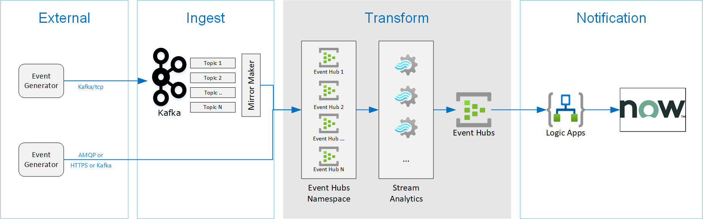

# Streaming Logic App Demo

This project demonstrates how to query streaming data from Kafka using several Azure technologies:

- Kafka Connect
- Azure Eventhubs
- Azure Streaming Analytics
- Azure Logic Apps
- Service Now Integration

Workflow:

- Generator App sents message to Kafka or Event Hubs
- Streaming Analytics will aggregate and filter messages into a second Event Hubs
- Logic App will read events and create a ticket in Service Now




# Setup

This setup will deploy the core infrastructure needed to run the the solution:

- Core Infratructure
- Generator App

## Core infrastructure

Configure the variables.

```bash
# Global
export RG_NAME=logic_demo
export RG_REGION=westus
export STORAGE_ACCOUNT_NAME=logic_demo

# Kafka
export KAFKA_VM_NAME=kafka-vm
export KAFKA_VM_NAME_NSG=kafkansg
export KAFKA_TOPIC=logic_app_demo

# Streaming Analytics
export SA_NAME=logic_app_demo_sa
export SA_JOB_NAME=logic_app_demo_sa
export SA_INPUT_NAME=SaInputName

# Event Hubs
export EH_NAMESPACE=LogicAppDemoEhn
export EH_NAME=logic_app_demo_eh

# Logic App variables
export LOGIC_APP_NAME=TicketApp
```

### Resource Group

Create a resource group for this project

```bash
az group create --name $RG_NAME --location $RG_REGION
```

### Kafka

Deploy the bitnami image of kafka. 

```bash
# Deploy VM
az deployment group create --name "{$KAFKA_VM_NAME}deployment" --resource-group $RG_NAME --template-file kafka/template.json --parameters kafka/parameters.json

# Open ports
az network nsg rule create -g $RG_NAME --nsg-name $KAFKA_VM_NAME_NSG -n KafkaEndpoint --priority 1020 \
    --source-address-prefixes <your_computer_ip>/32 --source-port-ranges Any \
    --destination-address-prefixes '*' --destination-port-ranges 9092 2181 --access Allow \
    --protocol Tcp --description "Allow from specific IP address ranges on 9092."

# Or for a quick port open
az vm open-port --resource-group $RG_NAME --name $KAFKA_VM_NAME --port 9092 # Kafka 
az vm open-port --resource-group $RG_NAME --name $KAFKA_VM_NAME --port 2181 # Zookeeper

# ssh onto machine
ssh kafka_user@<public_ip_of_kafka_deployment>
```

**Edit config properties**

The files found in `/project/kafka/configs/` show the config files that need to be changed. Ensure the associated files on the server match the settings found in the project files. The most importaint change is setting the `<public_ip_of_kafka_deployment>` in each of the configs.

- `config/consumer.properties`
- `config/producer.properties`
- `config/server.properties`

The location of the configs on the server are `/opt/bitnami/kafka/conf/`. After changing the configs. Restart the server.

```bash
# Edit configs
sudo vi /opt/bitnami/kafka/conf/consumer.properties
sudo vi /opt/bitnami/kafka/conf/producer.properties
sudo vi /opt/bitnami/kafka/conf/server.properties

# Restart and check status of services
sudo /opt/bitnami/ctlscript.sh restart
sudo /opt/bitnami/ctlscript.sh status
tail -n 400 /opt/bitnami/kafka/logs/server.log

# Testing Creating and reading messages

# create a new topic
/opt/bitnami/kafka/bin/kafka-topics.sh --create --zookeeper localhost:2181 --replication-factor 1 --partitions 1 --topic $KAFKA_TOPIC

# Start a new producer and generate a message in the topic
export KAFKA_OPTS="-Djava.security.auth.login.config=/opt/bitnami/kafka/conf/kafka_jaas.conf"
/opt/bitnami/kafka/bin/kafka-console-producer.sh --broker-list <public_ip_of_kafka_deployment>:9092 --producer.config /opt/bitnami/kafka/conf/producer.properties --topic $KAFKA_TOPIC

this is my first message
this is my second message

# Press `CTRL-D` to send the message.
# Press `CTRL-C` to stop the producer.

# Start a consumer to read the messages

 /opt/bitnami/kafka/bin/kafka-console-consumer.sh --bootstrap-server <public_ip_of_kafka_deployment>:9092 --topic $KAFKA_TOPIC --consumer.config /opt/bitnami/kafka/conf/consumer.properties --from-beginning
 ```

 ### Kafka-connect with Eventhub

 On the Kafka machine, download the [Kafka Connect plugin for Azure Event Hubs Connector](https://www.confluent.io/hub/confluentinc/kafka-connect-azure-event-hubs)

 ```bash
 wget https://d1i4a15mxbxib1.cloudfront.net/api/plugins/confluentinc/kafka-connect-azure-event-hubs/versions/1.2.0/confluentinc-kafka-connect-azure-event-hubs-1.2.0.zip

# TODO Document configuration
```

### Streaming Analytics

```bash
# Create a Job
az stream-analytics job create --resource-group $RG_NAME --name $SA_NAME --location $RG_REGION  --output-error-policy "Drop" --events-outoforder-policy "Drop" --events-outoforder-max-delay 5 --events-late-arrival-max-delay 16 --data-locale "en-US"

# Create input to eventhub
az stream-analytics input create --resource-group $RG_NAME --job-name $SA_JOB_NAME --name $SA_INPUT_NAME --type Stream --datasource @datasource.json --serialization @serialization.json

# Create Transformation query
az stream-analytics transformation create --resource-group $RG_NAME --job-name $SA_JOB_NAME --name Transformation --streaming-units "6" --transformation-query "${cat query.sql}"
```

### Evenhubs

```bash
# Create an Event Hubs namespace. Specify a name for the Event Hubs namespace.
az eventhubs namespace create --name $EH_NAMESPACE --resource-group $RG_NAME -l $RG_REGION

# Create an event hub. Specify a name for the event hub.
az eventhubs eventhub create --name $EH_NAME --resource-group $RG_NAME --namespace-name $EH_NAMESPACE

# Create the event hub for the filtered messages.
az eventhubs eventhub create --name "{$EH_NAME}Filtered" --resource-group $RG_NAME --namespace-name $EH_NAMESPACE

#Create Read Policy and Connection string**
#TBD
```

### Logic App

Make a copy of `logic_app\definition-example.json` and rename to `logic_app\definition.json`. Edit the file with the necessary values.

```bash
# Deploy the logic app
az logic workflow create --definition /path_to_project/logic_app/definition.json
--location $RG_REGION
--name $LOGIC_APP_NAME
--resource-group $RG_NAME
```

## Generator
The generator is a python application that runs in a docker container. The container expects the environment variables stored in a `local.env` file. 

Copy the `project_path/generator/local_example.env` to `project_path/generator/local.env` and edit the values.

The kafka password is found in `/opt/bitnami/kafka/ kafka_jaas.conf`

Run generator in docker

```bash
# Build and run image localy
> docker build --pull --rm -f "dockerfile" -t streaminglogicappdemo:latest "."
> docker run --rm -it --env-file local.env streaminglogicappdemo:latest

#Run app
> python main.py
```

# Development

The development environment is to manages two types of environments:

- Python Generator Code
- Azure Resources

## Python Generator code

Setup your dev environment by creating a virtual environment

```bash
# virtualenv \path\to\.venv -p path\to\specific_version_python.exe
python -m venv .venv.
.venv\scripts\activate

deactivate
```

## Style Guidelines

This project enforces quite strict [PEP8](https://www.python.org/dev/peps/pep-0008/) and [PEP257 (Docstring Conventions)](https://www.python.org/dev/peps/pep-0257/) compliance on all code submitted.

We use [Black](https://github.com/psf/black) for uncompromised code formatting.

Summary of the most relevant points:

- Comments should be full sentences and end with a period.
- [Imports](https://www.python.org/dev/peps/pep-0008/#imports) should be ordered.
- Constants and the content of lists and dictionaries should be in alphabetical order.
- It is advisable to adjust IDE or editor settings to match those requirements.


### Use new style string formatting

Prefer [f-strings](https://docs.python.org/3/reference/lexical_analysis.html#f-strings) over ``%`` or ``str.format``.

```python
#New
f"{some_value} {some_other_value}"
# Old, wrong
"{} {}".format("New", "style")
"%s %s" % ("Old", "style")
```

One exception is for logging which uses the percentage formatting. This is to avoid formatting the log message when it is suppressed.

```python
_LOGGER.info("Can't connect to the webservice %s at %s", string1, string2)
```

### Testing
You'll need to install the test dependencies into your Python environment:

```bash
pip3 install -r requirements_dev.txt
```

Now that you have all test dependencies installed, you can run linting and tests on the project:

```bash
isort .
codespell  --skip=".venv"
black generator
flake8 generator
pylint generator
pydocstyle generator
```

# References

- Python and Kafka https://towardsdatascience.com/getting-started-with-apache-kafka-in-python-604b3250aa05
- Connect to Kafka from remote machine https://docs.bitnami.com/azure/infrastructure/kafka/administration/connect-remotely/
- Kafka Listeners Explained https://www.confluent.io/blog/kafka-listeners-explained/
- VLookup capability in Logic app. See https://social.technet.microsoft.com/wiki/contents/articles/51608.vlookup-scenario-in-azure-logicapps.aspx
- Kafka Connect for eventhub https://docs.microsoft.com/en-us/azure/event-hubs/event-hubs-kafka-connect-tutorial
- How to use kafka connect https://docs.confluent.io/platform/current/connect/userguide.html#connect-userguide
- Azure Event Hubs Source Connector https://www.confluent.io/hub/confluentinc/kafka-connect-azure-event-hubs

